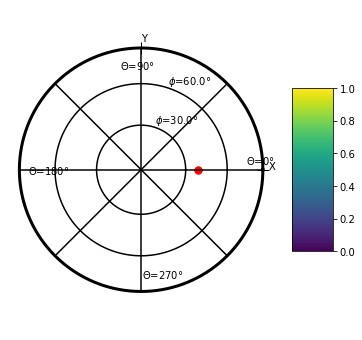

.. code:: ipython3

    import image3d.image3d as image3d
    import image3d.xcorr3d as xcorr3d
    import image3d.load_data as load_data

.. code:: ipython3

    import numpy as np
    import time
    import matplotlib.pyplot as plt
    from mpl_toolkits.mplot3d import Axes3D

Texture anisotropy analysis
~~~~~~~~~~~~~~~~~~~~~~~~~~~

This analysis is inspired from **Lehoucq et al 2015, “Analysis of image
vs. position, scale and direction reveals pattern texture anisotropy”**.

It is just an extention of the 2D analysis done in the paper to a 3D
analysis.

Principle
^^^^^^^^^

The main idea is to compute the inertia tensor for a 3D image. From this
inertia tensor we can extract anisotropic value and the principal
direction of anisotropy.

We note :math:`\vec{M}` a 3D image, and :math:`I(\vec{M})` the inertia
tensor assiciated to the image :math:`\vec{M}`. The dimention of
:math:`I(\vec{M})` is :math:`3\times3`.

:math:`\lambda_1`, :math:`\lambda_2`, :math:`\lambda_3` are the
eigenvalue of :math:`I(\vec{M})` associated with the eigenvector
:math:`\vec{e_1}`, :math:`\vec{e_2}`, :math:`\vec{e_3}`.

Differente anisotropic parameter can be build :

1) Relative anisotropy :
   :math:`std(\lambda_i)/\langle \lambda_i \rangle`

2) Fractional anisotropy :
   :math:`std(\lambda_i)/\langle \lambda_i^2 \rangle ^{1/2}`

3) 1-Volume ratio anisotropy :
   :math:`1-\lambda_1\lambda_2\lambda_3/ \langle \lambda_i \rangle ^3`

Building a artificial image
^^^^^^^^^^^^^^^^^^^^^^^^^^^

.. code:: ipython3

    size=200 #number of voxel size³
    center=size/2
    
    # image
    im=np.zeros([size,size,size])
    
    
    # disk image
    rd=int(10)
    disk=np.zeros([2*(rd+1),2*(rd+1)])
    for i in list(range(2*rd+2)):
        for j in list(range(2*rd+2)):
            if ((i-(rd+1))**2+(j-(rd+1))**2<rd**2):
                disk[i,j]=1
                
    # adding disk image
    shift=0
    for i in list(range(4)):
        k1=center
        for j in [-1,1]:
            k=int(center+j*i*28)
            im[int(j*shift+center-2),int(k1-rd-1):int(k1+rd+1),int(k-rd-1):int(k+rd+1)]=disk
            im[int(j*shift+center-1),int(k1-rd-1):int(k1+rd+1),int(k-rd-1):int(k+rd+1)]=disk
            im[int(j*shift+center-0),int(k1-rd-1):int(k1+rd+1),int(k-rd-1):int(k+rd+1)]=disk
            im[int(j*shift+center+1),int(k1-rd-1):int(k1+rd+1),int(k-rd-1):int(k+rd+1)]=disk
            im[int(j*shift+center+2),int(k1-rd-1):int(k1+rd+1),int(k-rd-1):int(k+rd+1)]=disk
            shift+=10
            
    res=1 # resolution of the image, size of the Voxel
    data=image3d.image3d(im,res)

Plot section of this image
^^^^^^^^^^^^^^^^^^^^^^^^^^

.. code:: ipython3

    plt.figure()
    data.plot('X',0.5)
    plt.title('Image, X section, X=0.5')

.. parsed-literal::

    Text(0.5, 1.0, 'Image, X section, X=0.5')

.. image:: output_5_1.png

.. code:: ipython3

    plt.figure()
    data.plot('Y',0.5)
    plt.title('Image, Y section, Y=0.5')

.. parsed-literal::

    Text(0.5, 1.0, 'Image, Y section, Y=0.5')

.. image:: output_6_1.png

.. code:: ipython3

    plt.figure()
    data.plot('Z',0.5)
    plt.title('Image, Z section, Z=0.5')

.. parsed-literal::

    Text(0.5, 1.0, 'Image, Z section, Z=0.5')

.. image:: output_7_1.png

Compute intertia tensor
^^^^^^^^^^^^^^^^^^^^^^^

.. code:: ipython3

    result=data.texture_anisotropy([np.shape(data.im)[0]])

Plot the ellipsoide associated with :math:`I(\vec{M})`
^^^^^^^^^^^^^^^^^^^^^^^^^^^^^^^^^^^^^^^^^^^^^^^^^^^^^^

.. code:: ipython3

    fig = plt.figure(figsize=(8,8))
    ax = fig.add_subplot(111, projection='3d')
    k=0
    for i in list(range(len(result[0]["Center box"]))):
        image3d.plotell(result[0]["Center box"][i],result[0]["Eigen value"][i],result[0]["Eigen vector"][i],color='b',alpha=0.3,factor=500,ax=ax)
    
    
    ax.set_xlabel('x')
    ax.set_ylabel('y')
    ax.set_zlabel('z')
    ax.set_xlim([0,200])
    ax.set_ylim([0,200])
    ax.set_zlim([0,200])

.. parsed-literal::

    (0, 200)

.. image:: output_11_1.png

The relative anisotropy of the inertia tensor is :

.. code:: ipython3

    print(result[0]['Relative anisotropy'])

.. parsed-literal::

    [0.69764084]

The principal direction of the relative anisotropy can be plot in a pole
figure :

.. code:: ipython3

    plt.figure(figsize=(6,6))
    result[0]['Main vector'].plot_vector('r')

Full texture anisotropy analysis
^^^^^^^^^^^^^^^^^^^^^^^^^^^^^^^^

The main idea is to analyse the texture anisotropy at different spatial
scale. To do so we will do this analysis for some subset of the initial
image :math:`\vec{M}`.

For instance if :math:`\vec{M}` as a size of
:math:`200\times200\times200` pixel\ :math:`^3`. We can make sub image
of dimention :math:`100\times100\times100` pixel\ :math:`^3` to do the
analysis. In this there will be 8 sub images.

Then it is possible to compute the average anisotropy for a given subset
size
:math:`\langle std(\lambda_i)/\langle \lambda_i \rangle \rangle_{subset 100}`
to access to anisotropy at a given scale.

For the orientation we can plot a stereographic projection of pricipal
direction of the inertia tensor and compute the second order
orientation.

In the following we performed the analysis for subset image of dimention
**sb** :

.. code:: ipython3

    sb=np.linspace(10,200,20)
    print(sb)

.. parsed-literal::

    [ 10.  20.  30.  40.  50.  60.  70.  80.  90. 100. 110. 120. 130. 140.
     150. 160. 170. 180. 190. 200.]

.. code:: ipython3

    dd=data.texture_anisotropy(sb)

We can plot the ellipsoide for the sb=10 pix and sb=200 as the patch
building the bigger pattern are 10 pixels wide.

.. code:: ipython3

    fig = plt.figure(figsize=(8,8))
    ax = fig.add_subplot(111, projection='3d')
    
    cc=['b','r']
    fc=[10,700]
    sub=[dd[0],dd[-1]]
    k=0
    for analyse in sub:
        for i in list(range(len(analyse["Center box"]))):
            image3d.plotell(analyse["Center box"][i],analyse["Eigen value"][i],analyse["Eigen vector"][i],color=cc[k],alpha=0.3,factor=fc[k],ax=ax)
        
        k+=1
    
    
    ax.set_xlabel('x')
    ax.set_ylabel('y')
    ax.set_zlabel('z')
    ax.set_xlim([0,200])
    ax.set_ylim([0,200])
    ax.set_zlim([0,200])

.. parsed-literal::

    (0, 200)

.. image:: output_20_1.png

It show that the ellipsoide are aligne in the y direction for nb=10 and
aligne in a x+z direction for nb=200. it can visualized using pole
figure :

.. code:: ipython3

    plt.figure(figsize=(10,5))
    
    plt.subplot(1,2,1)
    dd[0]["Main vector"].stereoplot(contourf=True,bw=0.2)
    plt.title('Box size = 10 pix')
    
    plt.subplot(1,2,2)
    dd[-1]["Main vector"].stereoplot(contourf=True,bw=0.2)
    plt.title('Box size = 200 pix')

.. parsed-literal::

    Text(0.5, 1.0, 'Box size = 200 pix')

.. image:: output_22_1.png

This analysis can be shown for more pixel size box.

.. code:: ipython3

    sub=[dd[0],dd[1],dd[3],dd[4],dd[9],dd[19]]
    plt.figure(figsize=(15,10))
    for i in list(range(6)):
        plt.subplot(2,3,1+i)
        sub[i]["Main vector"].stereoplot(contourf=True,bw=0.2)
        plt.title('Box size ='+str(sub[i]["Size box"]))

We can also plot the mean anisotropy factor in function of the box size
:math:`\langle std(\lambda_i)/\langle \lambda_i \rangle \rangle_{subset XX}`
:

.. code:: ipython3

    size_box=np.zeros([len(dd),1])
    ani=np.zeros([len(dd),1])
    for i in list(range(len(dd))):
        size_box[i]=dd[i]["Size box"]
        ani[i]=np.nanmean(dd[i]["Relative anisotropy"])

.. code:: ipython3

    plt.figure()
    plt.semilogx(size_box,ani)
    plt.grid()
    plt.xlabel('Box size : pixel')
    plt.ylabel('Anisotropy factor')

.. parsed-literal::

    Text(0, 0.5, 'Anisotropy factor')

To Do
^^^^^

Add time serie analysis of image and representation like figure 7.
Lehoucq

