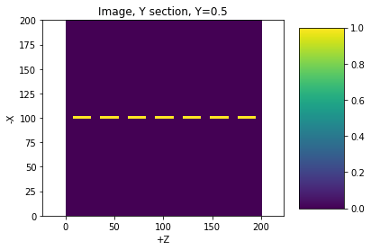
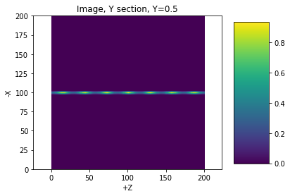
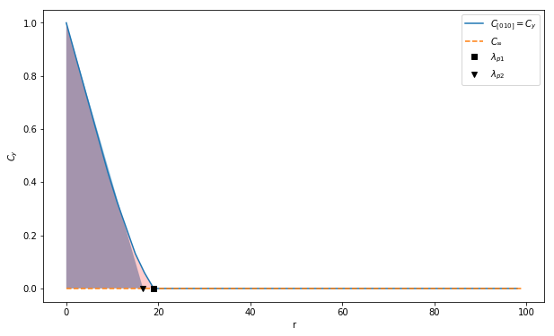
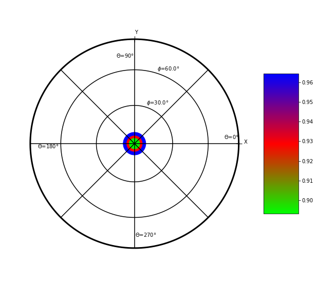
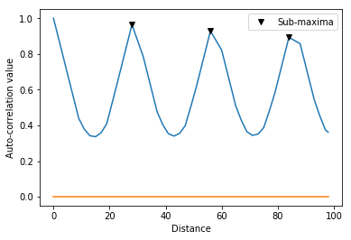

Documentation
=============

Load the toolbox
----------------

.. code:: ipython3

    import image3d.image3d as image3d
    import image3d.xcorr3d as xcorr3d
    import image3d.load_data as load_data

Build the image3d object
------------------------

image3d object is taking to parameter as input :

1) an image which is a numpy array of dimention N\ *M*\ L (gray level
   image)
2) a float which the the resolution of the image

It can be read from N tiff file sorted in one folder using the function
load\_data.load\_image\_from\_tiff (one tiff file per layer)

Here we will build a synthetic image

.. code:: ipython3

    import numpy as np
    import time
    import matplotlib.pyplot as plt

Building an image
~~~~~~~~~~~~~~~~~

Here is an example of a binary image, where 1 can be interpret as
fracture for instance

.. code:: ipython3

    size=200 #number of voxel size³
    center=size/2
    
    # image
    im=np.zeros([size,size,size])
    
    
    # disk image
    rd=int(10)
    disk=np.zeros([2*(rd+1),2*(rd+1)])
    for i in list(range(2*rd+2)):
        for j in list(range(2*rd+2)):
            if ((i-(rd+1))**2+(j-(rd+1))**2<rd**2):
                disk[i,j]=1
                
    # adding disk image
    for i in list(range(4)):
        k1=center
        for j in [-1,1]:
            k=int(center+j*i*28)
            im[int(center-2),int(k1-rd-1):int(k1+rd+1),int(k-rd-1):int(k+rd+1)]=disk
            im[int(center-1),int(k1-rd-1):int(k1+rd+1),int(k-rd-1):int(k+rd+1)]=disk
            im[int(center-0),int(k1-rd-1):int(k1+rd+1),int(k-rd-1):int(k+rd+1)]=disk
            
    res=1 # resolution of the image, size of the Voxel
    data=image3d.image3d(im,res)

Ploting an image
~~~~~~~~~~~~~~~~

.. code:: ipython3

    plt.figure()
    data.plot('Y',0.5)
    plt.title('Image, Y section, Y=0.5')

.. parsed-literal::

    Text(0.5, 1.0, 'Image, Y section, Y=0.5')

.. code:: ipython3

    plt.figure()
    data.plot('X',0.5)
    plt.title('Image, X section, X=0.5')

.. parsed-literal::

    Text(0.5, 1.0, 'Image, X section, X=0.5')

.. image:: output_8_1.png

.. code:: ipython3

    plt.figure()
    data.plot('Z',0.5)
    plt.title('Image, Z section, Z=0.5')

.. parsed-literal::

    Text(0.5, 1.0, 'Image, Z section, Z=0.5')

.. image:: output_9_1.png

Data analysis
-------------

Autocorrelation function
~~~~~~~~~~~~~~~~~~~~~~~~

Equations
^^^^^^^^^

For detail see Doumalin et al. 2003 (french) or Kanit et al. 2003 The
autocorrelation :math:`C (\vec{h})` function of the 3D image
:math:`f(\vec{x})` is defined as :

:math:`C(\vec{h})=\frac{\int_Vf(\vec{x})f(\vec{x}+\vec{h})dV}{\int_Vf^2(\vec{x})dV}`

Where :math:`\vec{x}` and :math:`\vec{x}+\vec{h}` are point describing
the volume :math:`V` of the image.

We can defined and infinite value as :

:math:`C_\infty=\frac{<f>^2_V}{<f^2>_V}`

Where :math:`<.>_V` is the mean on the volume V

Computation
^^^^^^^^^^^

.. code:: ipython3

    print ('Begining autocorrelation', time.asctime())
    autocorr=data.xcorr3d()
    print ('End autocorrelation', time.asctime())

.. parsed-literal::

    Begining autocorrelation Mon Mar 18 15:03:20 2019
    End autocorrelation Mon Mar 18 15:03:21 2019

Figures
^^^^^^^

.. code:: ipython3

    plt.figure()
    autocorr.plot('Y',0.5)
    plt.title('Image, Y section, Y=0.5')

.. parsed-literal::

    Text(0.5, 1.0, 'Image, Y section, Y=0.5')

.. code:: ipython3

    plt.figure()
    autocorr.plot('X',0.5)
    plt.title('Image, X section, Y=0.5')

.. parsed-literal::

    Text(0.5, 1.0, 'Image, X section, Y=0.5')

.. image:: output_14_1.png

.. code:: ipython3

    plt.figure()
    autocorr.plot('Z',0.5)
    plt.title('Image, Y section, Z=0.5')
    plt.clim(0,1)

Autocorrelation length :math:`\lambda_p`
~~~~~~~~~~~~~~~~~~~~~~~~~~~~~~~~~~~~~~~~

The autocorrelation length can be defined with two different definition
that can give differemt result.

1) Autocorrelation length : intersection definition :math:`\lambda_{p1}`
^^^^^^^^^^^^^^^^^^^^^^^^^^^^^^^^^^^^^^^^^^^^^^^^^^^^^^^^^^^^^^^^^^^^^^^^

Autocorelation radius in a direction :math:`\vec{v}` is defined as the
postition the first intersection of :math:`C_{\vec{v}}` and
:math:`C_\infty`. :math:`C_{\vec{v}}` is the profil of :math:`C` in the
direction :math:`\vec{v}`.

2) Autocorrelation length : integrale definition :math:`\lambda_{p2}`
^^^^^^^^^^^^^^^^^^^^^^^^^^^^^^^^^^^^^^^^^^^^^^^^^^^^^^^^^^^^^^^^^^^^^

:math:`\lambda_{p2}=\int_0^\infty (C_{\vec{v}}(r)-C_\infty) dr`

In practice it is compute as :

:math:`\lambda_{p2}=\int_0^{X_{0,p}} (C_{\vec{v}}(r)-C_\infty) dr`

Where :math:`X_{0,p}` is the autocorelation length in the direction p.

Both autocorrelation radius can give differente result and the first
definition :math:`\lambda_{p1}` can even have no value. It mean that the
correlation length in the direction :math:`\vec{v}` is higher than the
sample size.

Profil along y axis
^^^^^^^^^^^^^^^^^^^

.. code:: ipython3

    y=np.array([0,1,0])
    center=np.ones(3)*size/2
    end=np.ones(3)*size/2
    end[1]=size-1
    [res,xl]=autocorr.extract_profil(center,end)
    id=np.where(res<autocorr.Cinf)
    
    plt.figure(figsize=(10,6))
    plt.plot(xl,res,label='$C_{[010]}=C_y$')
    plt.plot([0,99],[autocorr.Cinf,autocorr.Cinf],'--',label='$C_\infty$')
    if id[0].shape[0]>1:
        plt.plot(xl[id[0][0]],res[id[0][0]],'sk',label='$\lambda_{p1}$')
    plt.xlabel('r')
    plt.ylabel('$C_y$')
    plt.legend()
    plt.grid()
    
    xi=2.*np.trapz(res-autocorr.Cinf,xl)
    
    X = np.array([[0,0], [0,1], [xi, autocorr.Cinf]])
    t1 = plt.Polygon(X,alpha=0.5)
    
    xy=np.transpose(np.concatenate([xl,res]).reshape(([2,99])))
    ii=np.array([[0.,autocorr.Cinf]])
    ie=np.array([[xl[-1],autocorr.Cinf]])
    xy=np.concatenate((np.concatenate((ie,ii),axis=0),xy))
    
    t2 = plt.Polygon(xy,facecolor='r',alpha=0.2)
    
    plt.gca().add_patch(t1)
    plt.gca().add_patch(t2)
    
    plt.plot(xi,autocorr.Cinf,'vk',label='$\lambda_{p2}$')
    
    plt.legend()
    plt.grid()
    

Profil alonf z axis
^^^^^^^^^^^^^^^^^^^

.. code:: ipython3

    z=np.array([0,0,1])
    center=np.ones(3)*size/2
    end=np.ones(3)*size/2
    end[2]=size-1
    [res,xl]=autocorr.extract_profil(center,end)
    id=np.where(res<autocorr.Cinf)
    
    plt.figure(figsize=(10,6))
    plt.plot(xl,res,label='$C_{[010]}=C_y$')
    plt.plot([0,99],[autocorr.Cinf,autocorr.Cinf],'--',label='$C_\infty$')
    if id[0].shape[0]>1:
        plt.plot(xl[id[0][0]],res[id[0][0]],'sk',label='$\lambda_{p1}$')
    plt.xlabel('r')
    plt.ylabel('$C_y$')
    plt.legend()
    plt.grid()
    
    xi=2.*np.trapz(res-autocorr.Cinf,xl)
    
    X = np.array([[0,0], [0,1], [xi, autocorr.Cinf]])
    t1 = plt.Polygon(X,alpha=0.5)
    
    xy=np.transpose(np.concatenate([xl,res]).reshape(([2,99])))
    ii=np.array([[0.,autocorr.Cinf]])
    ie=np.array([[xl[-1],autocorr.Cinf]])
    xy=np.concatenate((np.concatenate((ie,ii),axis=0),xy))
    
    t2 = plt.Polygon(xy,facecolor='r',alpha=0.2)
    
    plt.gca().add_patch(t1)
    plt.gca().add_patch(t2)
    
    plt.plot(xi,autocorr.Cinf,'vk',label='$\lambda_{p2}$')
    
    plt.legend()
    plt.grid()

.. image:: output_19_0.png

Autocorrelation length in function of the orientation
^^^^^^^^^^^^^^^^^^^^^^^^^^^^^^^^^^^^^^^^^^^^^^^^^^^^^

The autocorelation length can be compute in every direction and than
plot in a pole figure

:math:`\mathbf{\lambda_{p1}}`

It show some infinty value along **z** axis a shown by the back marker

.. code:: ipython3

    print ('Begining stereo proj', time.asctime())
    [eigvalue,eigvector,radiusmean,radiusstd,xmin,rmax]=autocorr.stereographic_corr_length(coeffCinf=np.array([1.]),pc=15)
    print ('End stereo proj', time.asctime())

.. parsed-literal::

    Begining stereo proj Mon Mar 18 15:03:23 2019
    End stereo proj Mon Mar 18 15:03:37 2019

.. image:: output_21_1.png

:math:`\mathbf{\lambda_{p2}}`

Using the second definition does not show infinit value by contruction.

.. code:: ipython3

    print ('Begining stereo proj', time.asctime())
    [eigvalue,eigvector,radiusmean,radiusstd,xmin,rmax]=autocorr.stereographic_corr_length(coeffCinf=np.array([1.]),pc=15,usePI=True)
    print ('End stereo proj', time.asctime())

.. parsed-literal::

    Begining stereo proj Mon Mar 18 15:03:38 2019
    End stereo proj Mon Mar 18 15:03:52 2019

.. image:: output_23_1.png

Submaxima and periodicity
~~~~~~~~~~~~~~~~~~~~~~~~~

The submaxima of the autocorelation function can be interesting to find
typical distance and orientation in the image. Here is a way to find
them :

.. code:: ipython3

    coor,vc,val=autocorr.local_maxima()

Sub-maxima position :math:`\vec{h}=[x,y,z]` and :math:`C(\vec{h})`

.. code:: ipython3

    for i in list(range(len(val))):
        print('h=[x,y,z] :'+str(coor[i])+', C(h))='+str(round(val[i],2)))

.. parsed-literal::

    h=[x,y,z] :[100 100 184], C(h))=0.89
    h=[x,y,z] :[100 100 156], C(h))=0.93
    h=[x,y,z] :[100 100 128], C(h))=0.96

Axis direction with the associate :math:`C(\vec{h})` value

.. code:: ipython3

    import matplotlib.cm as cm
    plt.figure(figsize=(10,10))
    vc.plot_vector(val[::-1],size=val[::-1]**20*4000,cm=cm.brg_r)

Submaxima on the profil

.. code:: ipython3

    import setvector3d.setvector3d as sv3d
    vc=sv3d.setvector3d(np.array([[0,0,1],[0,0,1]]))
    autocorr.correlation_profil(vc.vector[0])
    plt.plot(coor[:,2]-center,val,'vk',label='Sub-maxima')
    plt.legend()

.. parsed-literal::

    <matplotlib.legend.Legend at 0x7f23bc24f2e8>

Submaxima on autocorrelation slice

.. code:: ipython3

    autocorr.plot('Y',0.5)
    plt.plot(coor[:,2],center,'vk',label='Sub-maxima')

.. parsed-literal::

    [<matplotlib.lines.Line2D at 0x7f23bc1fa550>]

.. image:: output_33_1.png

